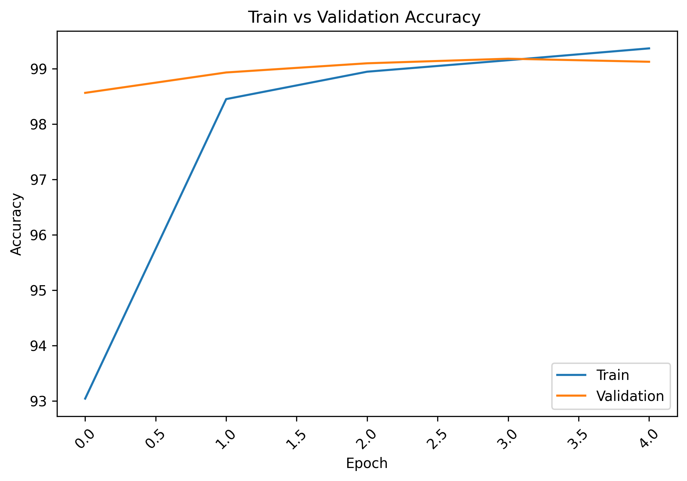
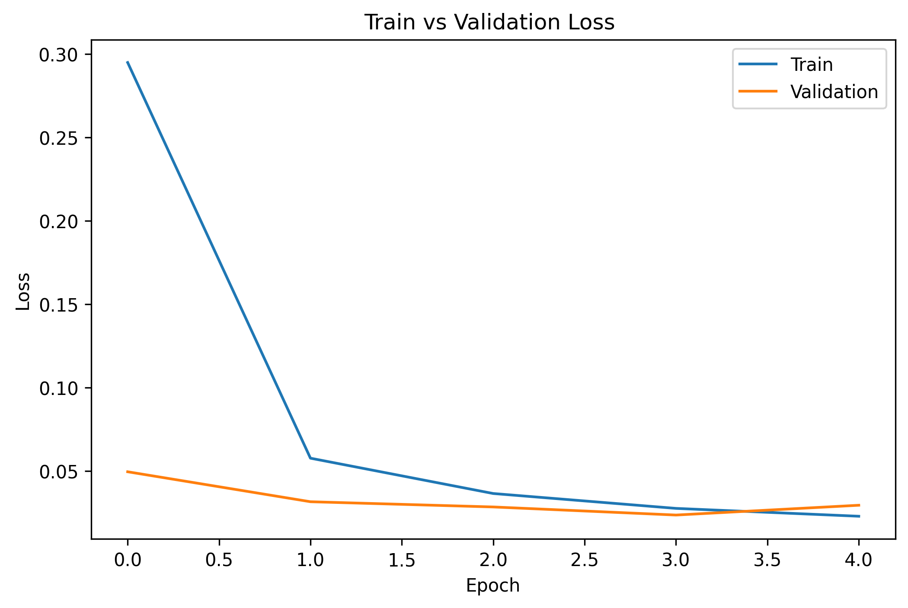

# Plant Disease Detection using Transfer Learning (ResNet18)

## Project Overview

This project focuses on automatic plant disease classification using Deep Learning and Transfer Learning techniques. A pretrained ResNet18 model was fine-tuned on the PlantVillage dataset to classify plant leaf diseases across 38 categories.

The objective is to assist farmers and agricultural professionals by providing a fast and accurate disease identification system from leaf images.

---

## Features

* Transfer Learning using ResNet18 pretrained on ImageNet
* Fine-tuning of the final ResNet block (`layer4`)
* Data Augmentation for improved generalization
* ImageNet Normalization
* Multi-class classification across 38 plant disease categories
* Training and Validation Performance Tracking
* Classification Report Evaluation
* Confusion Matrix Analysis
* Model Checkpoint Saving
* Single Image Inference Support

---

## Dataset

Dataset Used: PlantVillage

### Dataset Statistics

| Metric            | Value  |
| ----------------- | ------ |
| Number of Classes | 38     |
| Training Images   | 43,444 |
| Validation Images | 10,861 |
| Total Images      | 54,305 |

The dataset contains healthy and diseased leaf images from multiple crops including:

* Apple
* Corn
* Grape
* Orange
* Peach
* Pepper
* Potato
* Soybean
* Strawberry
* Tomato

---

## Model Architecture

### Backbone

ResNet18 (Pretrained on ImageNet)

### Fine-Tuning Strategy

* Frozen Layers:

  * Conv1
  * Layer1
  * Layer2
  * Layer3

* Trainable Layers:

  * Layer4
  * Custom Classification Head

### Classification Head

```python
nn.Sequential(
    nn.Dropout(0.3),
    nn.Linear(512, 38)
)
```

---

## Training Configuration

| Parameter     | Value            |
| ------------- | ---------------- |
| Optimizer     | Adam             |
| Learning Rate | 1e-4             |
| Loss Function | CrossEntropyLoss |
| Epochs        | 5                |
| Batch Size    | 64               |
| Image Size    | 224 × 224        |

### Data Augmentation

```python
RandomHorizontalFlip()
RandomRotation(10)
```

### Normalization

```python
mean = [0.485, 0.456, 0.406]
std  = [0.229, 0.224, 0.225]
```

---

## Training Results

### Validation Performance

| Metric              | Score  |
| ------------------- | ------ |
| Validation Accuracy | 99.35% |
| Macro F1 Score      | 0.99   |
| Weighted F1 Score   | 0.99   |

### Training Accuracy Progress



### Training Loss Progress



---

## 📊 Classification Report Summary

The model achieved near-perfect performance across most disease categories.

Strongest performing classes included:

* Apple Diseases
* Grape Diseases
* Soybean Healthy
* Orange Citrus Greening
* Tomato Mosaic Virus

More challenging classes included:

* Corn Gray Leaf Spot
* Tomato Early Blight
* Potato Healthy

These categories exhibit higher visual similarity with related disease classes.

---

## 🧪 Evaluation

### Validation Accuracy

```text
99.35%
```

### Macro F1 Score

```text
0.99
```

### Weighted F1 Score

```text
0.99
```

The model demonstrates excellent generalization with only a 0.16% gap between training and validation accuracy.

---

## 📁 Project Structure

```text
PlantDiseaseDetection/
│
├── assets/
│   ├── training_curves_accuracy.png
│   ├── training_curves_loss.png
│   ├── confusion_matrix.png
│   └── prediction_demo.png
│
├── PlantDiseaseDetection.ipynb
├── plant_disease_resnet18.pth
├── requirements.txt
└── README.md
```

---

## 💾 Saving the Model

```python
torch.save(
    model.state_dict(),
    "plant_disease_resnet18.pth"
)
```

---

## Future Improvements

* Deploy using Streamlit or Gradio
* Mobile Application Integration
* Real-time Camera-Based Disease Detection
* Support for Field Images with Complex Backgrounds
* Confidence Thresholding
* Grad-CAM Explainability Visualization

---

## 🛠️ Technologies Used

* Python
* PyTorch
* Torchvision
* NumPy
* Pandas
* Matplotlib
* Scikit-learn
* Google Colab GPU

---

## Author

Aayush Krishna

Machine Learning | Deep Learning | Computer Vision
